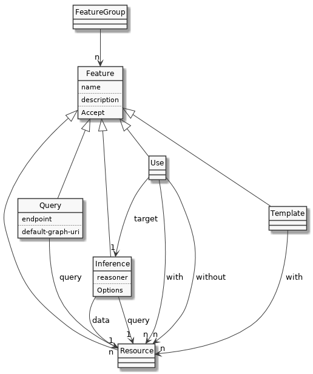

# HES agent

Demo that generates APIs from data and N3 rules. In this example, links are specified through JSON files and responses are generated applying N3 rules to RDF data.

* [example json](./examples/family/index.json)
* [example rule](./examples/family/rules)
* [example data](./examples/family/data)

The HES POC use [N3 Logic](http://infomesh.net/2002/notation3). Notation N3 is a rule-based language defined as a superset of turtle that adds support for additional constructs. Is possible, for instance, to describe a set of rules to generate new knowledge, extending the data.

```
  {
    ?animal :eats :meat.
    ?animal :eats :plants.
  }
  =>
  {
    ?animal a :omnivore.
  }.
```

The rules are stated using curly brackets `{}` and the implication symbol `=>.`

A typical reasoning operation combines data with rules and a query. The results are then serialized in [Json-LD](https://json-ld.org) to be consumed by applications. An agent might also expose their knowledge artifacts and features through the URLs.

Other things can be specified directly in the json, such as queries to REST endpoints or rendering an application

# Current operations

By default, the API is defined using `index.json` files to be recursively read from a directory. There are some [examples](./workspace).



# Running the agent

Note: (To try the application without installing all this, you can use the Docker version below)

## Default entry points

API

* http://localhost:3000/dataspaces

Dependency graph

* http://localhost:3000/dataspaces/dependencies

Built-in applications:

* http://localhost:3000/apps/flare


## Running it as command line

First of all, you need to **install the EYE reasoner** ([Windows](http://eulersharp.sourceforge.net/README.Windows) – [OS X](http://eulersharp.sourceforge.net/README.MacOSX) – [Linux](http://eulersharp.sourceforge.net/README.Linux)).

Alternatively, install it from the [source](https://github.com/josd/eye)

(make sure that you can run this using '/bin/sh eye,' or set the EYE_PATH environment variable)

Then, install the server package as follows:

``` bash
$ [sudo] npm -g install hes-agent
```

### Running

```
hes serve <directory>
```

More options with

```
hes --help
```

### Examples

The [workspace](./workspace) folder contains [examples](./workspace) on what kind of things can be declared.

To see the results do:

```
hes serve ./workspace
```

and point your browser to:

```
http://localhost:3000
```

Then 'follow the links'

Operations and dependency graph:
```
http://localhost:3000/dataspaces/operations
```

## Run with docker

### Start HES on host port 3000:

```
docker run --name=hes-agent -p 3000:3000 -v $PWD/workspace:/usr/src/app/workspace cristianvasquez/hes-agent -t
```

Running your image with -d runs the container in detached mode, leaving the container running in the background.
The -p flag redirects a public port to a private port inside the container.
The -v flag mounts a directory to a directory inside the container.

If you need to go into the container you can use the exec command:

## Enter the container

```
docker exec -it hes /bin/bash
```

### Stop the docker container

```
docker rm -f hes-agent
```

## Test if it's up

```
curl -i localhost:3000
```

### Build your own image

```
docker build . -t YOUR_USERNAME/hes-agent
```

(to build a clean image from scratch use the --no-cache option)

# Components


